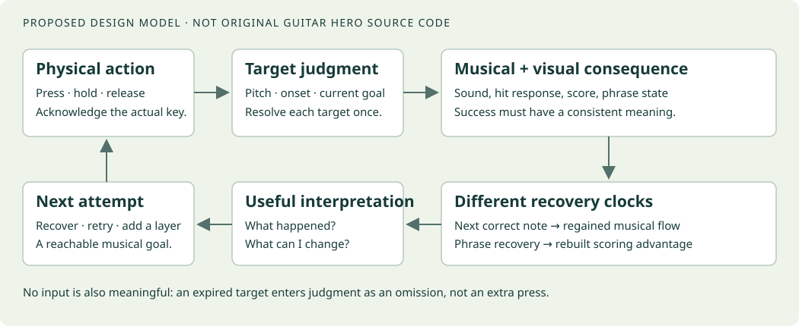

# Make the next attempt worth playing

**Guitar Hero research and a design north star for MIDI-HERO**
September 27, 2026 · Independent of the existing MIDI-HERO build

**The recommendation:** build around the pleasure of contributing a recognizable part to a song. Give every physical action a clear response, make successful musical participation feel different from merely pressing a key, and let a mistake lead naturally to recovery and another attempt. Begin with authored, reduced-complexity arrangements within two octaves. Increase musical responsibility before requiring more keys.

This is a researched design report, with recommendations distinguished from established mechanics. It draws on original manuals, developer interviews, inspected public code and tests, a matched chart comparison, learning research, and sampled gameplay frames. **The audiovisual investigation is incomplete:** five original-game recordings were visually sampled, but the tools did not expose their sound for direct listening. A failure recording was blocked by managed browser restrictions. The planned 12–18-recording audiovisual corpus was not completed. Audio claims below are documentary, not claims about sounds personally heard. No original executable was run, and exact original judgment and audio-envelope code was not recovered. Those limitations affect precision about engine behavior; they do not prevent a useful, explicitly provisional north star.

**The product brief:** fun gameplay should get people actually playing songs on a keyboard. Two octaves are the starting physical range, not a ceiling on depth. This report does not assume the current implementation, an imported-MIDI workflow, a classroom-only audience, or any existing feature proposal.

**Audio follow-up:** the [feasibility pilot](audio-pilot-findings.md) checked existing source access and analysis-tool readiness but did not establish original sound, a verified listener or a measurable error/recovery sequence. No new behavior is labeled **heard** or **measured**; manual/teaching evidence remains **documented** within its scope, and keyboard policies remain **inferred** proposals. A [capture and annotation handoff](audio-pilot-handoff.md) supports resuming the study. A short [student trial](student-audio-trial.md) can separately test actual-note audibility and recovery before that study finishes; it does not validate retail Guitar Hero mechanisms or durable learning.

**Reading paths:** read the numbered design principles and decision table for the north star; use the feedback contract and arrangement example for prototypes; use the linked evidence memos for exact sources and implementation details.

1. **What Guitar Hero makes worth practicing**

   The most useful explanation is a stack of reinforcing experiences. A song gives the player something they want to participate in. A constrained controller makes an initial contribution achievable. A readable chart turns the next action into an understandable target. Immediate consequences make success perceptible. Streaks, resources, and results give additional reasons to improve. Difficulty versions let a familiar musical experience become a new challenge. Replay, and the section-practice facilities documented for GH2/3, make the next attempt accessible.

   This is a causal design interpretation, not the result of an experiment that isolated each component. The original developers describe performance sensation, rapid prototyping, and extensive tuning; designer Rob Kay describes both beatmatching and Star Power's strategic role. Neither establishes a universal retention formula. [Original postmortem](https://www.gamedeveloper.com/audio/classic-postmortem-guitar-hero) · [Rob Kay interview](https://www.gamedeveloper.com/design/book-excerpt-inside-game-design-harmonix-music-systems)

   The distinction between **participating now** and **mastering eventually** is crucial. A beginner needs a satisfying present-tense role, not a promise that the game becomes musical after weeks of drills. The reduced arrangement must be a musical object worth playing in its own right. A tiny number of notes can work if those notes have an identifiable job; a much denser chart can fail if the player's contribution is masked or confusing.

   Four kinds of progress should remain available: completing a song, playing it more consistently, taking on a richer part, and exploring another song with familiar demands. These reward different players. A score optimizer and a novice who finally finishes a favorite chorus should both have legitimate accomplishments. Perfect performance should not be the only visible definition of progress.

   The boundary of this explanation matters. A loved soundtrack, physical performance, competition with friends, novelty, and pre-existing enthusiasm can also explain continued play. A MIDI-HERO prototype with unfamiliar exercises cannot establish that the same mechanics will work with motivating songs; a prototype using a favorite song cannot isolate the effect of its scoring system. Test those factors deliberately.

2. **Feedback is a contract between action and consequence**

   A feedback effect is useful when the player can interpret it correctly while continuing to play. The important contract has three layers:

   | Layer | Player's question | Required meaning | Common design failure |
   | --- | --- | --- | --- |
   | Input acknowledgment | Did the instrument register what I did? | A key/control changed state | A wrong input looks like an unresponsive device |
   | Judgment | Did that action satisfy this musical target? | A particular opportunity was accepted, missed, or only partly completed | The same flash means both “pressed” and “correct” |
   | Guidance | What useful adjustment can I make? | A specific next action, at a moment when it can be understood | A barrage of labels says “bad” without diagnosing anything |

   

   The separation is explicit in Egozy's simplified teaching specification: button state and judged note events have different responsibilities. That is valuable architectural and interaction evidence, but the assignment is not a complete retail-game implementation. [MIT specification](https://ocw.mit.edu/courses/21m-385-interactive-music-systems-fall-2016/ad8c22178b0c4d54ee46bfcd85d98fb1_MIT21M_385F16_pset7.pdf)

   For a keyboard, acknowledgment should preserve the physical truth: which key was pressed, held, and released. Success effects should refer to the intended arranged target. Those two displays may coincide, but their meanings must stay distinct. If a player presses D while C is expected, a C-shaped success burst would teach the wrong causal relationship; no visible D response could make them suspect the keyboard.

   The input event also differs from the opportunity. A missed target can occur without any input. An extra press can occur when no target is available. An early release follows a successfully begun note. A partly played chord contains both successful and missing actions. Calling all four “misses” is acceptable shorthand for a result screen, but inadequate as the underlying behavior specification.

   **Recommended event flow, proposed for MIDI-HERO:** acknowledge the physical event; compare it with explicitly eligible targets; update each target at most once; update performance state; emit coherent sound/visual/results events. Keep expiration of an unplayed target separate from evaluation of an incoming press. Record the reason for a judgment so a practice summary can explain it later.

   This is also why matching rules matter to perceived fairness. Suppose two identical notes are close together. A late strike for the first must not unexpectedly consume the second. Suppose a chord is intended to sound together. Real fingers do not land in the same computer timestamp; the specification needs a justified coordination allowance. Suppose a player corrects a wrong key. The game needs an explicit policy for whether the original target is still available. These are product decisions before they are implementation details.

   Do not copy a plastic guitar's fret-plus-strum rules into a piano. A keyboard note onset already combines choosing a pitch and producing an attack. Repeated pitches require fresh articulation; a held key does not ordinarily represent several new attacks. Sustain pedal state and finger-held state are also different facts. Teach and judge each only when that musical demand has been introduced.

3. **Sound should make the player's contribution real**

   Three sound mechanisms must be distinguished: playing the actual note the person performs; triggering a corrected target note; and controlling the audibility of a recorded performance. They can all sound rewarding, but they teach different relationships between action and music. Original GH manuals document separate playable-guitar and backing mix controls; the developer teaching model uses separate recordings. Exact retail mute/fade/recovery behavior is still unresolved in this investigation. [Technical evidence and limits](technical-evidence.md)

   Guitar Hero's abstraction creates a useful design opportunity: sparse physical actions can accompany a musically rich result. On a real keyboard, that opportunity needs to be used carefully. The goal is that players perform the simplified arrangement, not merely authorize a more complicated piano recording. Accompaniment can make eight beginner notes feel like a complete song without pretending those eight notes were a full virtuoso part.

   **Recommended starting hypothesis:** the foreground instrument sounds the actual played pitch promptly, while the backing supplies the other arranged roles. This keeps the key-to-pitch relationship truthful and allows a player to hear a correction. Test it against explicitly assisted sound; do not assume it is automatically the most enjoyable choice for every novice.

   A wrong note is already informative sound. Adding a loud error noise to it may make the event harder to interpret. Conversely, in a dense mix the wrong note may be impossible to notice, so the sound alone is not sufficient feedback. Judge the combination: actual pitch, visual target mismatch, and a restrained additional cue where necessary. Avoid rewarding wrong input with an indistinguishably perfect foreground part.

   Missing a player-owned note should leave an audible absence in that role. The band should generally keep the pulse so the player can re-enter. Silencing unrelated instruments is a separate dramatic penalty, with a real cost: it removes the rhythmic reference needed for recovery. Prototype that only if it improves the intended experience; it is not required by the core principle of musical consequence.

   The arrangement and the mix form one system. If accompaniment doubles the player's line at full volume, the player can stop and still hear apparent success. If the beginner's part is too exposed and unsupported, every small error can dominate the experience. A useful audition consists of three passes: the intended player part, the accompaniment alone, and the combined arrangement with occasional omitted or wrong notes. Ask whether the player's job is audible, enjoyable, and recoverable in all three.

   Timing trust comes before grading strictness. Input delay, audio output delay, visual alignment, and judgment offset are distinct. Wider hit windows cannot repair a note that audibly responds late. A GH2 calibration mod explicitly separates input alignment from an audio offset, but its constants and sign conventions are not a specification for MIDI-HERO. [Calibration patch source](https://github.com/hmxmilohax/gh2-calibration-fix/blob/e11ec53fcd48231ab0ea0be58b658bcc9ec69f08/_ark/ui/funcs.dta#L15-L30)

4. **Use graphics to protect the next action**

   The highway does two jobs: it tells the player what will happen next, and it gives a stable place to judge when to act. Effects at the strike line can confirm success without pulling attention away from upcoming notes. A meter elsewhere answers a slower question about the run. A sentence of diagnostic advice asks for still more attention. They should not compete at the same moment.

   Across the sampled GH1–3 performance frames, strike targets, upcoming note shapes, and score/performance displays coexist with stage scenery; the GH3 sample also shows a sustained-note trail. The relevant observation is functional separation, not proof that perspective or flames cause motivation. In a GH3 sample, the multiplier display loses its prior state and later rebuilds while the highway and stage continue. That suggests an important recoverability distinction: an interrupted streak is not necessarily an interrupted song. [Visual observation notebook](gameplay-observations.md)

   For a two-octave keyboard, recognition becomes harder than identifying five colored lanes. Preserve recognizable black/white key structure and a clear relationship to physical keys. A two-octave hardware limit need not mean showing every possible key with equal emphasis all the time. Compare a stable full-range reference with emphasis on the active region; avoid moving the target mapping so abruptly that players must relearn the display mid-phrase.

   Primary RB3 interviews directly address keyboard compression, display legibility, and the authoring burden of real pitches. These are useful precedent, not evidence that copying the RB3 interface guarantees learning. [Developer interview](https://cdm.link/rock-band-3-behind-the-scenes/)

   **Proposed visual hierarchy:** upcoming musical actions first; immediate input and judged-hit response second; phrase/run state third; scenery and celebration around those. Celebrate a milestone without covering the next target. On a miss, preserve enough visual continuity to find the next entrance. Do not make a struggling player's already difficult reading task darker, busier, or more unstable unless a playtest demonstrates a worthwhile benefit.

   Guidance belongs at different time scales. A simple directional indication can convey an isolated early/late result. After a phrase, a short cue can identify a recurring tendency. After a song, a replayable excerpt can explain the main obstacle. Prefer a small number of actionable distinctions over continuous numerical grading that the player cannot use while playing.

5. **Make recovery visible even when the streak is gone**

   There are at least three recovery clocks. The player can make a correct next action almost immediately. The musical phrase may take longer to regain coherence. The scoring multiplier can take still longer to rebuild. These are different successes. A player who is now performing correctly should not continue to receive feedback that feels like total failure merely because the old multiplier has not returned.

   Original manuals establish the broad streak and Star Power contract. Public CHOpt code makes an especially useful technical point: even the scoring boundary differs across its GH1 and GH2/3 models. It treats the tenth successful note head differently between them. The optimizer is inspectable modeling evidence, not the original input or audio engine. [Engine definitions](https://github.com/GenericMadScientist/CHOpt/blob/38d13d46a61b18fff4905e3dc978adae398d0af4/include/engine.hpp#L305-L471) · [Multiplier code](https://github.com/GenericMadScientist/CHOpt/blob/38d13d46a61b18fff4905e3dc978adae398d0af4/src/points.cpp#L474-L490)

   The practical implication is larger than a ten-note threshold. A multiplier makes consistency valuable by increasing the future value of success. Losing it can therefore motivate concentration, but it can also make an imperfect run feel economically pointless. A full-song game needs reasons to continue after that loss: recovering a difficult section, reaching a personal completion goal, or improving a previously weak phrase.

   Do not equate a high score with accurate timing or transferable musicianship. A player may score more through strategic resource use, a richer chart, or a better streak distribution. Keep those achievements legitimate while comparing personal improvement under the same arrangement and settings. A perfect phrase played today can be worth celebrating even if the overall run scores below yesterday's.

   Star Power offers a second decision beyond matching notes: when to spend an earned resource. That is valuable evidence that rhythm games can support agency inside a fixed song. A keyboard equivalent needs to justify its physical interface and musical consequences. Do not commandeer sustain pedal behavior by default. First establish that playing and recovering from the arrangement are enjoyable; then test whether an extra resource decision enriches that experience without competing with the hands and attention needed to play.

   Failure should be designed around its next action. A terminal fail can create a memorable challenge and a clear achievement. It can also replace productive playing with menus and repetition of already mastered openings. Offer a performance challenge with stakes and a practice route with a short lead-in, a bounded phrase, and a clear return to the full song. The distinction is purpose, not whether one mode is “real” playing. GH1's planned section/slowdown practice mode was cut; it should not be credited for the first game's initial appeal. [Postmortem](https://www.gamedeveloper.com/audio/classic-postmortem-guitar-hero)

6. **A proposed feedback contract for the keyboard game**

   Everything in this table is a prototype recommendation. It is not a reconstruction of any one Guitar Hero engine. Durations, timing tolerances, penalty sizes, and chord allowances need playtesting and device validation.

   | Event | Immediate response | Performance accounting | Useful later guidance |
   | --- | --- | --- | --- |
   | Any key press/release | Show the actual key state; sound the played instrument according to the chosen sound policy | No success merely for making input | Device or mapping diagnosis if response is absent |
   | Correct pitch within the accepted onset interval | Distinct strike-line success; target resolves once | Credit the target; maintain phrase/streak state | Timing detail only when helpful |
   | Correct pitch outside the interval | Acknowledge the key; distinguish premature/late action from success | Apply an explicit target-consumption policy; avoid accidental double credit | Repeated timing tendency, with a replayable example |
   | Wrong pitch while a target is available | Show actual key versus intended key; preserve intelligible sound | Do not silently substitute a correct target; explicitly define whether correction remains possible | Identify a repeated pitch or position confusion |
   | Target expires with no accepted action | Brief visible missed-target state; backing pulse continues | Resolve once as omitted; no phantom extra input | Offer the entrance or phrase that was missed |
   | Extra note between targets | Acknowledge and sound it; distinguish it from an omitted note | Rules should prevent random-key spam from outperforming intentional play | Explain extra attacks only if a recurring problem |
   | Some notes of a chord arrive | Acknowledge each pitch immediately; group success waits for the defined coordination rule | Preserve partial-success information; do not hide which note was absent | Show the chord shape or coordination demand |
   | Held note released early | Release the sound naturally; alter its remaining trail | Only penalize duration if duration is an announced current objective | Practice holding or coordinating releases |
   | Correct note after an error | Restore full local success feedback immediately | Begin rebuilding longer-term state | Recognize re-entry rather than prolonging the failure signal |
   | Phrase completed or improved | Compact musical/visual punctuation at a safe moment | Compare like-for-like results | One relevant next challenge or practice option |
   | Repeated breakdown | Keep the next entrance readable | Track the pattern rather than multiplying error noise | Offer a shorter phrase or simpler arrangement |

   Four non-negotiable specification checks follow. Each target must have one terminal judgment. Each input must have a diagnosable disposition. Sound and success graphics must agree about what the player controlled. A recovery event must be distinguishable from a restored historical streak. These are engineering acceptance criteria derived from the proposed interaction contract, not claims that Guitar Hero implements precisely this architecture.

   Test boundary scenarios explicitly: an early key held through the target; a late correction; two same-pitch targets close together; chord notes arriving separately; a stray note during a sustain; pedal-held sound after finger release; pause/resume; and an input arriving near a difficulty or section transition. These cases matter because players experience inconsistent edge cases as unfairness, even when the implementation is internally deterministic.

7. **Difficulty is authored musical responsibility**

   The clearest concrete comparison came from “Shout at the Devil,” GH2 PS2, measure 19. In third-party SlowHero renders, Easy contains three attacks, Medium five, and Hard/Expert six each. The harder two differ in chord shapes and control range. This is evidence against treating difficulty as a single density slider. It is a visual comparison of archived chart renders, not independently verified extraction from the shipped executable. [Passage evidence and sources](arrangements-evidence.md)

   | Dimension | Can become harder without more range? | Example keyboard demand |
   | --- | --- | --- |
   | Rhythm | Yes | Add offbeats or repeated-note articulation |
   | Pitch vocabulary | Yes | Add a neighboring or black key in the same region |
   | Harmony | Yes | Add one companion note to selected attacks |
   | Coordination | Yes | Introduce a sustained left-hand note under a familiar melody |
   | Duration and overlap | Yes | Preserve one note while another changes |
   | Movement | Sometimes | Move between nearby positions with a clear preparation gap |
   | Endurance | Yes | Sustain a pattern through a longer phrase |
   | Register/range | No, when physical range grows | Transfer a familiar bass role to a lower octave |

   A beginner arrangement should state what the person is playing: the hook, a bass riff, chord entrances, or a melodic skeleton. Choose that role before reducing events. Preserve the gesture's important entrances, arrivals, rests, and cadence. Where the hook depends on a distinctive rhythm, thinning that rhythm may destroy its identity; a shorter passage or different role may be a better simplification.

   Mechanical octave folding can change contour and introduce awkward jumps even while every resulting note lies within the permitted range. Work at phrase level: select the key, choose a register, decide which voice matters, voice chords for the hand, and assign the remaining roles to accompaniment. Automated analysis can flag excessive span, density, or boundary violations. It cannot certify that a part is satisfying.

   Continuity between versions deserves its own playtest. A beginner who knows the anchor notes should recognize them in the richer arrangement. Retain pitches and entrances where musically sensible. Do not preserve bad fingering merely to avoid change, and do not make every later chart a mandatory strict superset. Document when a new role requires a genuine shift of approach so the player does not interpret relearning as lost ability.

   The same principle applies to rewards. A recommended setlist can expose skills in a useful order, while a favorite song supplies personal motivation. A worthwhile novice version should have meaningful recognition and access. Copying every historical unlock restriction would reproduce choices whose motivational benefits have not been established here.

   **Arrangement review questions:** Can the player name or hear their role? Is the part worth playing without a score? Is it playable at the intended hand position? Does its backing leave room for the player? Are the new demands identifiable? Can the player recover after the hardest moment? Does the next version respect the useful learning from this one?

8. **A reviewable two-octave example**

   “First Lights” is an original four-bar illustration made for this report. It is not a tested curriculum or evidence of player preference. The starting instrument can be C3–C5 inclusive, a 25-key span of two octaves; the initial examples stay within C3–B4, and the first melody uses C4–G4. Scientific notation here uses C4 = MIDI 60. Suggested demonstration tempo is 100 BPM in 4/4; that is an illustrative choice, not a recommended universal beginner speed.

   | Version | What the player owns | Main new demand | What makes it a musical next step |
   | --- | --- | --- | --- |
   | A: Anchors | Two melody attacks per bar, using C4/E4/G4 | Establish the pulse and phrase arrivals | Eight meaningful notes form a complete phrase |
   | B: Riff | Add D4 and quarter-note motion | More continuous movement in the same hand region | More of the melodic shape becomes the player's work |
   | C: Full melody | Add two eighth-note pairs | A more detailed rhythm | The riff gains internal motion without extra range |
   | D: Melody and bass | Add authored C3/A3/F3/G3 bass entrances | Coordinate two roles | The player now supplies the harmonic foundation too |
   | E: Richer texture | Add selected comfortable chord tones or articulation | One chosen harmonic or expressive demand | Depth remains available on the same small keyboard |
   | F: Wider instrument branch | Move the bass role down an octave | New register and physical separation | More range without simultaneously adding rhythm or note count |

   In version A, drums, bass, and restrained harmony support the player's sparse lead. They should not covertly perform its complete foreground melody. In D, accompaniment relinquishes the bass role. This makes expansion an audible increase in responsibility, not just more targets layered over an unchanged automatic performance.

   D is a candidate step, not necessarily one beginner-sized jump: the left hand's changes may need intermediate versions. E deliberately leaves exact voicings open for physical testing. F is optional; wider range is not proof of superior musicianship. A two-octave player should keep receiving worthwhile songs and richer versions.

   The [complete note-by-note illustration and authoring rubric](arrangements-evidence.md) specifies every bar of A–D and the intended backing roles. It should be reviewed as musical content, then played by target novices, before being promoted to a curriculum. Its purpose is to make the design decisions inspectable, not to replace the motivating repertoire the actual product needs.

9. **Learning claims must remain narrower than the enthusiasm**

   It is reasonable to expect repeated play to improve performance on practiced game tasks. It is not reasonable to assume that this proves independent song recall, general rhythm knowledge, good technique, sight-reading, or broad piano proficiency. Those are different outcomes, each with its own test.

   Motivation research supplies a plausible mechanism: clear control and perceived competence can relate to enjoyment and continued play. It does not isolate Guitar Hero's flames, meters, or muting as causal ingredients. [Ryan, Rigby, and Przybylski](https://selfdeterminationtheory.org/SDT/documents/2006_RyanRigbyPrzybylski_MandE.pdf)

   The music-game literature also warns that similar in-game performance can coexist with different transfer outcomes. The inspected Rock Band study compared game practice with added drumming instruction; it supports measuring transfer separately, not a conclusion about keyboard pedagogy. A small GHII study likewise cautions against assuming that matching targets demonstrates metrical understanding. [Learning and transfer study](https://www.sciencedirect.com/science/article/pii/S0360131518302781) · [GHII rhythm study](https://repository.isls.org/handle/1/2902)

   Motor-learning findings are not a license to declare audio inherently superior to visuals or constant feedback inherently harmful. The information supplied, the task, the feedback schedule, and who struggles to learn all matter. The evidence memo records scope and exclusions so that an attractive result is not overstated. [Learning evidence and methodological limits](developer-learning-evidence.md)

   This does not require turning the game into schoolwork. A brief cue attached to a phrase the player wants to beat can be useful. A later optional attempt without some visual assistance can reveal what they now know. The core product should still earn voluntary play; transfer measurement is how development checks its ambitions rather than advertising them prematurely.

10. **Priorities and prototype decisions**

   These priorities are recommendations derived from the evidence and brief. They are ordered by dependency and uncertainty, not by implementation cost in the existing repository.

   | Priority | Decision | Starting direction | What would change the recommendation? |
   | --- | --- | --- | --- |
   | 1 | What does the player musically own? | Author one compelling two-octave part and complementary backing | Players cannot hear the role, dislike it, or cannot recognize the musical idea |
   | 1 | Can players trust the instrument? | Prompt actual input response; separate acknowledgment and judgment | Device measurements or player explanations expose ambiguity |
   | 1 | What happens after an error? | Preserve the pulse, make local recovery immediate, give a useful next attempt | Errors feel inconsequential, or recovery feedback encourages careless play |
   | 2 | What should success sound like? | Start with actual played notes; compare explicit assisted sound | Assistance improves voluntary play without concealing the arranged actions being learned |
   | 2 | How should success be graded? | Clear primary success/failure, optional timing detail | More precise feedback improves correction without increasing distraction or confusion |
   | 2 | What makes the next version achievable? | Preserve meaningful anchors; introduce a salient new demand | Transfer tests reveal relearning, boredom, or multiple simultaneous bottlenecks |
   | 2 | How do stakes support practice? | Test streaks and phrase goals; preserve reasons to finish imperfect runs | Players repeatedly abandon recoverable runs or stop experimenting |
   | 3 | Does a strategic resource add value? | Prototype only after the musical loop works | It adds meaningful decisions without disrupting keyboard playing |
   | 3 | How much spectacle helps? | Add effects around a readable, stable performance interface | Visual excitement measurably improves desire without harming reading/recovery |

   A feature should earn its place by changing a player experience. A multiplier that nobody notices does not create meaningful stakes. An effect that obscures notes spends attention without improving information. A practice loop that loses the phrase entrance can make a good idea harder to execute. Evaluate the entire action and retry path.

11. **A validation sequence that can disprove the recommendations**

   Begin with a formative pilot, not a claim of statistical proof. Recruit people with little keyboard experience, plus separate experienced-keyboard and rhythm-game groups. Include participants who struggle or want to quit. Use several short arrangements so song preference and order are not completely confounded with the feature under test. Counterbalance conditions; retain a clear record of instrument, latency settings, arrangement, and tempo.

   **First, test the causal sound connection.** Compare actual-note sound and explicitly assisted sound with the same targets and accompaniment. Ask players to identify their contribution and explain a few errors after the passage. Observe unprompted continuation, intelligibility of correction, and whether they can reproduce the intended short part. A favorite condition that conceals the target skill is a tradeoff to address, not an automatic winner.

   **Second, test feedback comprehension and recovery.** Compare a simple success signal with success plus useful timing information. Keep judging rules fixed. Log accepted notes, omissions, extra inputs, and chord partials separately. After errors, measure how many upcoming opportunities pass before coherent playing resumes. Pair that with the player's account; logs alone cannot explain whether the feedback felt fair.

   **Third, test arrangement progression.** Give one group an authored beginner version before the richer version and compare an appropriate alternative ordering. Ask whether earlier practice helps with preserved anchors. Check that differences are not merely wider windows, slower tempos, or easier charts. Evaluate enjoyment and voluntary choice as well as successful notes.

   **Fourth, test the practice route.** Compare replaying the whole song with an offered phrase loop that includes a lead-in and a return to the song. Measure improvement on the next full-song attempt under unchanged conditions. Watch for players who loop successfully but cannot re-enter the phrase in context.

   **Fifth, test stakes and continued participation.** Compare streak-centered results with results that also recognize phrase improvement and recovery. Count recoverable runs abandoned after an error, chosen next challenges, and voluntary retries. A longer session is not automatically better if the player is frustrated or making no useful adjustment.

   **Finally, test retention and modest transfer.** On another day, repeat the same arrangement at the same settings. Then try a related unfamiliar phrase or reduced guidance. State precisely what improved: the learned part, rhythm continuation, pitch recall, coordination, or something else. Set product thresholds after baseline observation; this report does not invent scientifically validated acceptable retry rates or timing tolerances.

   | Outcome | Example evidence | What it does not prove |
   | --- | --- | --- |
   | Desire | Voluntary next attempt and later return | Learning |
   | Comprehension | Correct explanation of the event and a useful adjustment | Enjoyment |
   | Local mastery | Better performance on the same arrangement/settings | General musicianship |
   | Retention | Comparable performance after a delay | Transfer to new material |
   | Transfer | Better performance on a specified unfamiliar or less-assisted task | Complete keyboard proficiency |

12. **What is firm enough to guide development now**

   **Adopt:** authored musical roles; an identifiable next action; separate physical acknowledgment and judged success; visible local recovery; meaningful novice arrangements; independent progression in complexity and range; results that distinguish completion, consistency, strategy, and actual learned performance.

   **Adapt and test:** timing detail, penalty intensity, streak resets, failure modes, assisted sound, resource mechanics, the amount of visible keyboard range, and the balance between whole-song play and targeted practice. These are consequential choices, not settled facts established by Guitar Hero's popularity.

   **Avoid as defaults:** automatic per-note octave folding presented as a finished arrangement; indistinguishable sound for correct and wrong musical actions; hidden assistance presented as proficiency; clutter that makes errors harder to recover from; simultaneous jumps in range, coordination, and density; and claims that in-game success proves broad musical learning.

   The north star is a concrete experience: **“I can hear what I am adding to this song. I know when it worked. A mistake does not leave me lost. The next attempt has a purpose. The next version lets me play more of the music.”**

**Evidence package and remaining verification**

- [Gameplay observation notebook](gameplay-observations.md): inspected frames, source timestamps, input-visibility limits, access failures, and unverified audio.
- [Technical evidence](technical-evidence.md): primary manuals, commit-pinned code and tests, scoring calculations, reconstructed examples, and original-engine unknowns.
- [Arrangement evidence](arrangements-evidence.md): original developer authoring accounts, the four-difficulty chart comparison, and full original arrangement illustration.
- [Developer and learning evidence](developer-learning-evidence.md): intent, teaching specification, empirical findings, counterevidence, and study limitations.
- [Independent source review](review-notes.md): checks against source code and manuals, corrections, and constraints on synthesis.
- [Audio assessment plan](audio-assessment-plan.md): proposed controlled recordings, verified listening, signal measurements and keyboard experiments to resolve the outstanding audio questions.
- [Audio pilot findings and limitations](audio-pilot-findings.md): actual access checks, unresolved completion gates and next actions; [handoff](audio-pilot-handoff.md) for a recorder and listener.
- [Student audio trial](student-audio-trial.md): a small formative protocol for testing provisional keyboard feedback sooner, independent of the existing build.

The highest-value missing research is controlled original-game input/video/audio capture around wrong input, omission, early release, and first successful recovery. It should verify actual mute/unmute envelopes and their relationship to judgment; the current evidence cannot. Also outstanding are broader novice/failure video coverage, a measured original-game scoring replay, and empirical tests of the keyboard recommendations. The report is ready to guide prototypes; these gaps should remain visible when converting hypotheses into firm requirements.
