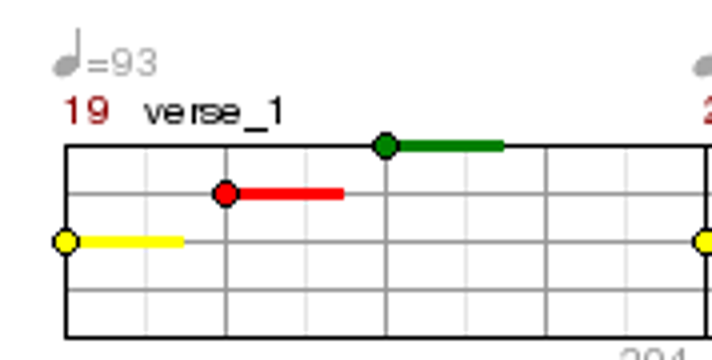
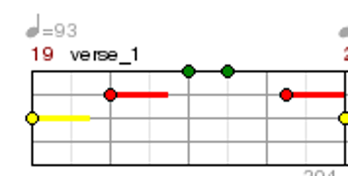
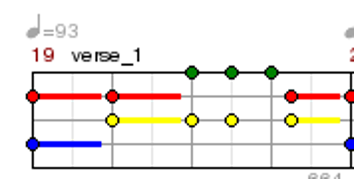
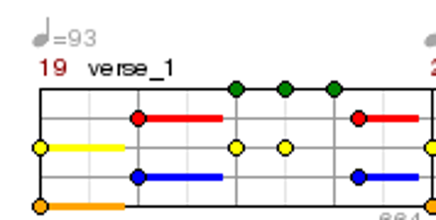

# Guitar Hero chart design, progression, and two-octave keyboard arrangements

Research memo, 27 September 2026. This research does not use the current MIDI-HERO build. Sources were read; the GH2 manual and matched chart images were visually inspected. No audiovisual gameplay claim is made in this memo.

## Principal finding

**An arrangement is the playable experience, not merely a difficulty filter.** Guitar Hero developers describe an iterative process of choosing musically salient actions, matching the contour and physical feeling of the part, and smoothing both the song order and the versions of each song. For MIDI-HERO the equivalent is an authored, satisfying musical role whose actual notes can be played on a keyboard, with additional responsibility introduced in coherent steps. That translation is a design recommendation, not an established learning outcome.

## Original/developer evidence

| ID | Evidence and exact location | What it establishes | Confidence and limits |
| --- | --- | --- | --- |
| A1 | [Guitar Hero II PS2 manual](https://www.videogamemanual.com/PS2/Guitar%20Hero%20II%20%28Dual%20Pack%29%20%28USA%29.pdf), printed GHM 7, 8, 12 (PDF pp. 9, 10, 14), visually inspected | See the consolidated manual findings in technical-evidence.md. Co-op additionally allows separate difficulties and shares survival. | High for the documented PS2 rules. The manual does not specify the slowdown ratios, practice retry latency or exact section selection UI. It establishes available feedback, not its motivational effect. |
| A2 | [Iain Simons interview with GH1 designer Rob Kay](https://www.gamedeveloper.com/design/book-excerpt-inside-game-design-harmonix-music-systems), December 5, 2007, answers beginning “What's the process for creating the gem tracks?” and “Presumably that forced…” | Developer evidence D2 contains the consolidated account of chart selection, QA, and difficulty analysis. | High for the designer's account of process; source does not disclose the analyzer formula or prove the final ramp was smooth for everyone. |
| A3 | [GH1 retrospective interviews with Eric Brosius and Greg LoPiccolo](https://www.gamesradar.com/we-were-basically-trying-to-keep-harmonix-afloat-the-making-of-guitar-hero/), passages about authoring after peripheral design | They describe Expert-first authoring around musical contour, then simplification. Difficulty existed across song order and within each song. Button combinations and long phrases received musical/physical interpretation, informed by playing real guitar. | High for stated intent, with retrospective-memory limits. Does not imply every lower chart is a strict subset of Expert. |
| A4 | [Greg LoPiccolo on Rock Band Network](https://www.gamespot.com/articles/harmonixs-lopiccolo-talks-rock-band-network/1100-6216301/), August 27, 2009, question “Is any of this automated?” | Easier tracks were usually subsets of Expert, but good reductions required authoring judgment; general automatic chart generation was not their process. Audition and review tested the results. | High for RBN, not direct GH engine evidence. Supports authoring workflow as a related Harmonix practice. |
| A5 | [Harmonix: A Fireside Chat with Rhythm Authors](https://www.harmonixmusic.com/blog/a-fireside-chat-with-rhythm-authors), February 18, 2016, authoring-process answer | Roughly half project time went to QA. All difficulties were reviewed; in-game evaluation checked mix and the connection between chart and audio. Automated checks supplemented human review. | High for this RB4/RBN authoring team. Not a universal production cost estimate. |
| A6 | [CDM interview with Rock Band 3 leads](https://cdm.link/rock-band-3-behind-the-scenes/), October 26, 2010, “Beyond Rhythm Games” and difficulty-authoring answers | RB3 is a particularly relevant adjacent precedent: two-octave MIDI keyboard hardware and real-pitch play. Sussman describes simpler Pro arrangements as accompaniment along with the song, with progressively fuller responsibility. The root-note/power-chord/open-chord ladder described in that answer is specifically guitar-shaped; it is not a keyboard curriculum. Berklee advisers reviewed fingering, musical language, and progression. | High for documented design and consultation. Developer aspirations and journalist enthusiasm are not measurements of durable learning. Do not transfer the guitar chord ladder directly to beginner piano. |

**Interpretation:** the strongest evidence is for careful content construction and testing. Evidence that those choices *caused voluntary productive practice* remains inferential. A famous song, performance fantasy, existing musical taste, social play, controller novelty and self-selection can all contribute.

## A matched passage actually inspected

**Song/version:** “Shout at the Devil,” Guitar Hero II, PS2, measure 19, labeled `verse_1`. **Artifact:** SlowHero's rendered note charts, one for each difficulty. This is a third-party chart-rendering archive, not an original Harmonix source or captured gameplay. The chart is primary evidence of what the archive renders; its agreement with shipping game data was not independently verified from a game binary. The site identifies itself as a ScoreHero support site and distinguishes PS2/X360/title/difficulty. Confidence is high in the visual comparison, moderate in its exact correspondence to the shipping build.

Legend: G/R/Y/B/O = green/red/yellow/blue/orange. A plus means simultaneous colored gems in one attack; commas separate successive attacks. These are symbolic controller lanes, **not musical pitch names**. Sustain tails are not counted as additional attacks.

| Difficulty | Visible attack sequence in measure 19 | Attack count | Distinct lanes in this measure | What changed |
| --- | --- | ---: | ---: | --- |
| Easy | Y, R, G | 3 | 3 | Sparse single-note contour |
| Medium | Y, R, G, G, R | 5 | 3 | Denser rhythm despite no added lane here |
| Hard | R+B, R+Y, G+Y, G+Y, G, R+Y | 6 | 4 | Chords, extra attack, altered lane mapping |
| Expert | Y+O, R+B, G+Y, G+Y, G, R+B | 6 | 5 | Same attack count as Hard; changed chord shapes and control range |

Sources inspected: [Easy](https://slowhero.moto-coda.org/gh2-ps2/easy/shoutatthedevil.blank.png), [Medium](https://slowhero.moto-coda.org/gh2-ps2/medium/shoutatthedevil.blank.png), [Hard](https://slowhero.moto-coda.org/gh2-ps2/hard/shoutatthedevil.blank.png), [Expert](https://slowhero.moto-coda.org/gh2-ps2/expert/shoutatthedevil.blank.png). [Archive provenance](https://slowhero.moto-coda.org/).

The four inspected measure crops are saved under `evidence/arrangements/shout-m19-{easy,medium,hard,expert}.png` beside this memo. They include only the short passage used for analysis.

| Easy | Medium |
| --- | --- |
|  |  |

| Hard | Expert |
| --- | --- |
|  |  |

**Design inference from the comparison:** difficulty is multidimensional. Counting notes alone misses chord complexity and physical reach. Even a shared rhythm can require different motor patterns. An easier part can preserve a musical gesture while remapping controls; on a real keyboard such remapping would change the sounding pitches, so MIDI-HERO should preserve actual retained pitches more strongly. Inspect transitions *between arrangements*, not just each arrangement in isolation.

This example does not establish a title-wide frequency distribution, exact audio ownership, HOPO behavior, or whether novices recognized the intended contour. No millisecond conclusions can be drawn from a static chart.

## What to preserve, adapt, and test

| Decision | Recommended direction | Why | When not to use / main tradeoff | Observable check |
| --- | --- | --- | --- | --- |
| Authored difficulty versions | Preserve a musical role and recurring anchors as layers are added. | A2–A5 support intentional authoring and QA; retention benefits are a hypothesis. | Do not force strict subsets when they make a poor musical part or harmful fingering. | After an easier version, does the player recognize the motif and retain useful action timing on the richer version? |
| Range versus difficulty | Keep substantial progression inside two octaves; increase rhythm, harmony, coordination or articulation separately. | Actual comparison demonstrates independent difficulty dimensions. Real keyboard constraints add span and hand motion. | Some songs need register movement to preserve identity; choose a different role or explicitly re-arrange the phrase. | Can a two-octave owner keep finding worthwhile challenges without buying a larger keyboard? |
| New hand position | Introduce movement in a sparse, familiar passage before combining it with density and chords. | Inference from GH's changing control range and the keyboard's physical constraints. | Not a fixed universal order; some players already use both hands. | Is the first expanded-position failure about movement alone, or several new demands at once? |
| Staged musical ownership | Make the notes assigned to the player audible and consequential; as their part grows, reduce overlapping accompaniment. | The arrangement must connect action with sound (A5) and the brief requires real keyboard performance. | Complete exposure of a sparse novice part can sound thin; dense accompaniment can mask errors. | With backing present, can the player hear their part and tell whether it stopped or changed? |
| Song access/rewards | Give a satisfying beginner performance and meaningful rewards; consider a recommended path alongside free song choice. | GH's career structure supplies goals; Easy store exclusion is documented, but its benefit is not established. | Unlocks may increase anticipation but can obstruct the very song motivating a novice. | Do players choose a next achievable challenge voluntarily, and can they access a motivating song at an appropriate level? |
| Practice | From a failed phrase, offer a bounded retry with lead-in and optional slowdown, followed by a return to the song. | GH2 documents section practice and slowdown (A1). The proposed one-step navigation/lead-in is our extension. | Repeating isolated notes can lose phrase context; slowing without later full-speed checks may conceal the bottleneck. | Does practice change the next full-song attempt at the same settings? |
| Results | Show credible within-version improvement and one useful next target. | A1 establishes GH's song/streak/accuracy feedback; diagnosing one next action is a proposed improvement. | More charts and numbers can become homework; high raw scores across different arrangements are not comparable evidence of learning. | Can the player explain what improved and select a next attempt without interpreting a statistical report? |

## Arrangement acceptance rubric (proposed)

These are authoring criteria and prototype questions, not validated thresholds.

1. **Identity:** identify the hook, riff, groove, bass motion or chord attack that defines the player's role. Do not treat every MIDI note as equally valuable.
2. **Ownership:** state which musical events belong to the player. Accompaniment may enrich the song, but should not silently play the same foreground line so perfectly that player actions become inaudible.
3. **Coherence:** simplify a whole gesture deliberately. Remove ornaments before destroying phrase shape; preserve meaningful entrances, rests and cadences. Sometimes a different role is the better beginner arrangement.
4. **Physical playability:** list active pitches, simultaneous notes, span, position changes, repeated-note demand, hand assignment and recovery rests. A low note count is not enough.
5. **Continuity:** retain pitches, onsets and stable fingering where musically sensible. Flag required relearning explicitly. Do not keep an awkward beginner fingering merely for continuity.
6. **Mix:** listen both with and without accompaniment. Successful playing should contribute something satisfying; an omission should be perceptible without collapsing the whole performance.
7. **Judgment contract:** specify which dimensions currently matter—pitch/onset, then duration/chord coordination/articulation when introduced. Assistance should not create false claims about what was played.
8. **Range integrity:** choose a transposition and phrase registers before individual octave changes. Mechanical modulo-12 folding can invert contours and create leaps; neither folding nor note deletion is a finished arrangement.
9. **Replay shape:** give the player a recognizable recurring motif, a bounded new challenge and a satisfying return. Include recovery opportunities after demanding material.
10. **Human check:** have target novices and experienced keyboard players play every version, including transitions between versions. Automated checks should catch bounds and impossible spans, not certify musical quality or fun.

## Worked original example: “First Lights”

This newly authored four-bar design illustration is not an existing song, published arrangement, or validated teaching sequence. It avoids relying on a copyrighted commercial chart. Its purpose is to make the progression decisions reviewable; familiarity with beloved songs remains a separate product requirement.

**Music:** 4/4, suggested 100 BPM; C major; a repeating riff with a final descent to C. The tempo is an illustration, not a research-backed beginner threshold. Initial available range C3–B4 (MIDI 48–71; scientific pitch C4=MIDI60). A 25-key C3–C5 controller also fits. The actual first role uses just C4–G4. `q/e/h/w` = quarter/eighth/half/whole-note duration; hyphenated pairs in parentheses are simultaneous. Durations sum to four quarter beats per bar.

| Bar | Full one-hand riff | Beginner anchor version (same retained pitches/onsets) | Backing harmony suggestion |
| --- | --- | --- | --- |
| 1 | C4 q, E4 e, D4 e, G4 q, E4 q | C4 h, G4 h | C |
| 2 | C4 q, D4 q, E4 h | C4 h, E4 h | Am |
| 3 | C4 q, E4 q, G4 e, E4 e, D4 q | C4 h, G4 h | F, colored by passing melody notes |
| 4 | E4 q, D4 q, C4 h | E4 h, C4 h | G on beats 1–2, C on beats 3–4 |

**Why the reduction is deliberate:** the beginner owns eight attacks using three pitches, including the two upward arrivals on G and the closing C. It is a simplified lead part in its own right. At this level the accompaniment should not play a hidden full version of this same lead; it can carry drums, bass and restrained harmony. The longer beginner sustains are an arrangement choice; retained onset and pitch continuity does not mean every duration remains identical.

| Variant | Player responsibility | New demand | Accompaniment responsibility | Reason to replay / what to verify |
| --- | --- | --- | --- | --- |
| A: Anchors | Eight notes from the anchor column, right hand | Two attacks per bar; three pitches | Drums, bass, harmony; no doubled lead | Hear a complete phrase and its cadence. Check that sparse playing still feels causal and satisfying. |
| B: Quarter-note riff | Bar 1 C4 q, E4 q, G4 q, E4 q; bars 2 and 4 as full riff; bar 3 C4 q, E4 q, G4 q, D4 q | Add D4 and quarter-note movement while keeping anchors | Same backing roles | More melody under the same hand position. Check that anchors learned in A transfer. |
| C: Full one-hand riff | Full riff above | Eighth-note pairs in bars 1 and 3 | Same backing roles | Complete the riff's internal motion; no expansion of range or chord load. |
| D: Add bass | Full riff plus LH C3 w, A3 w, F3 w; in bar 4 G3 h then C3 h | Two-hand coordination and changes between bass positions | Backing relinquishes bass ownership; drums/harmony remain | The player now creates both melodic and harmonic movement. This could be split into several intermediate steps if bass movement overwhelms. |
| E: Two-octave texture | Keep melody and bass; experiment with selected RH thirds or LH root/fifth voicings, authored for comfortable spans | A chosen chord or articulation demand, introduced singly | Remove the matching harmonic events from backing | A richer performance remains available inside C3–B4. Specific voicings need physical playtesting; do not automatically double every melody note. |
| F: Expanded-range branch | Retain the learned melody; move only the bass role down an octave (C2/A2/F2/G2) on a larger keyboard | Spatial separation and a new register | Same roles as D | Demonstrates expansion without increasing note count or rhythm. It changes hand-location demands; it is an optional branch, not proof of higher musical merit. |

A natural part can contain simpler and richer local passages. These variants are content versions, not a demand that every song follow identical levels. For some songs, owning a bass riff or offbeat chord pulse is more recognizable and rewarding than a reduced melody. For another, the hook is too rhythmically distinctive to simplify much; choose a smaller passage or a slower tempo before destroying it.

## Recommended progression model and measurements

Track demands separately: pitch set, rhythm density/irregularity, chord size/span, hand movement, hands required, note release/overlap, velocity/articulation, phrase length/endurance, and range. A single visible level may summarize these, but authors need the full profile. No source here supplies validated weights for combining them.

Offer three directions of progress: a new song with familiar demands, a richer role in a familiar song, or a modest new physical skill in a sparse passage. This is a design hypothesis derived from the two axes described by the GH developers, expanded for keyboard realities. It should preserve choice while keeping the next step intelligible.

In a prototype, compare authored reductions against a simple note-thinning baseline **only as an experimental comparator**, holding song, backing and tempo comparable. Observe whether participants recognize their role, can hear their own contribution, voluntarily replay, recover after an error, and retain useful timing/pitch knowledge when the version changes. After a delay, repeat with reduced visual guidance or an unfamiliar related passage. Separate enjoyment and in-game mastery from durable keyboard skill.

The decisive product question is not “How many notes can fit in two octaves?” It is: **Does each version give the player an audible, satisfying part they can own today, and a next version that rewards what they have already learned?**
